# Smart Storage Cleaner — Design Handoff (v1 to v1.3)

**Project:** Smart Storage Cleaner  
**Versions covered:** v1.0, v1.1, v1.2, v1.3  
**Design goal:** premium, calm, intelligent, privacy-first storage app that feels closer to a built-in system app than a typical utility app.

---

# 1. Design direction

## 1.1 Core feeling

The app should feel:
- calm
- premium
- modern
- precise
- privacy-first
- safe for personal memories

The app should not feel:
- noisy
- ad-driven
- neon / gamer-like
- cluttered
- cheap utility booster style

## 1.2 Visual principles

1. generous whitespace
2. clear hierarchy
3. rounded premium cards
4. subtle shadows
5. restrained blue / teal accents
6. soft semantic colors
7. human-readable recommendations

---

# 2. Shared UI system

## 2.1 Color direction

- background: warm white / soft off-white
- primary text: near-black / deep navy
- secondary text: cool gray-blue
- primary accent: teal-blue gradient
- support blue: icy blue
- success / verified: mint-green
- warning / waiting: soft amber
- alert / failed: soft coral

## 2.2 Typography

- screen titles: extra bold, large, left aligned
- subtitles: lighter gray-blue, large enough to read comfortably
- card headlines: semibold / bold
- metrics: bold, high contrast
- metadata: softer gray-blue

## 2.3 Components

- hero summary cards
- rounded list tiles
- provider badges
- segmented category control
- primary CTA pill buttons
- secondary outline / pale buttons
- thumbnail strips
- status badges
- cloud verified badge
- settings / form rows

---

# 3. Navigation model

Bottom navigation remains consistent:
- Home
- Clean
- Library
- Insights
- Settings

Version additions use the same shell and appear as screens pushed from Settings or Library flows.

---

# 4. Screenshot inventory

## v1.0
1. `01_Onboarding_Privacy.png`
2. `02_Home_Dashboard.png`
3. `03_Clean_Select_Target.png`
4. `04_Cleanup_Plan.png`
5. `05_Similar_Photos_Groups.png`
6. `06_Best_Shot_Review.png`
7. `07_Insights_Storage_Forecast.png`
8. `08_Videos_Compression.png`
9. `09_Settings_Privacy_OnDeviceAI.png`
10. `10_Memories_Protected.png`
11. `11_Screenshots_Semantic_Cleanup.png`

## v1.1
12. `12_Cloud_Sync_Overview_v1_1.png`
13. `13_Manual_Backup_Receipts_v1_1.png`

## v1.2
14. `14_Storage_Rules_v1_2.png`
15. `15_New_Rule_Builder_v1_2.png`

## v1.3
16. `16_Receipt_Filing_v1_3.png`
17. `17_Backup_Verification_Safe_Delete_v1_3.png`

---

# 5. Screen-by-screen handoff

---

## 01 — Onboarding / Privacy promise (v1.0)

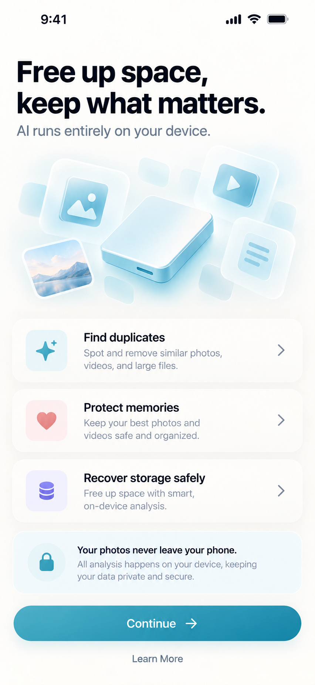

**Purpose**  
Introduce value, establish trust, emphasize on-device AI and privacy.

**Key UI elements**
- large hero headline
- privacy subline
- decorative storage/media illustration
- 3 benefit cards
- privacy reassurance card
- primary CTA

---

## 02 — Home dashboard (v1.0)

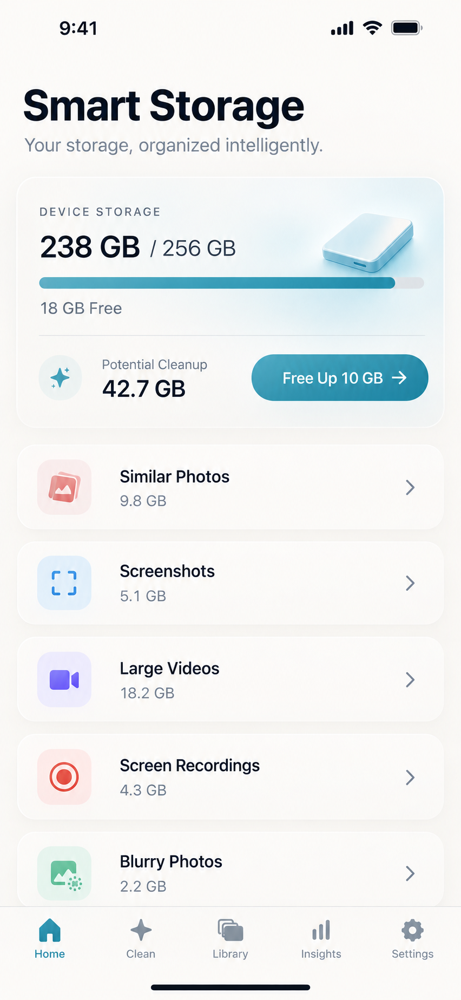

**Purpose**  
Give immediate storage overview and entry into cleanup categories.

**Key UI elements**
- storage usage hero card
- free space metric
- potential cleanup metric
- cleanup categories list
- CTA for target-based cleanup

---

## 03 — Clean target selection (v1.0)

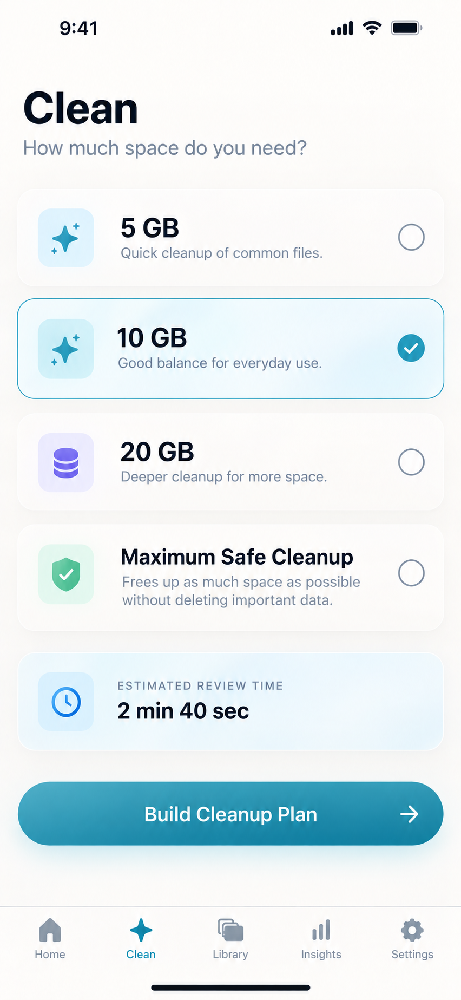

**Purpose**  
Let users choose cleanup by desired result, not by technical category.

**Key UI elements**
- 5 GB / 10 GB / 20 GB / Maximum Safe Cleanup options
- selected card state
- estimated review time card
- build cleanup plan CTA

---

## 04 — Cleanup plan (v1.0)

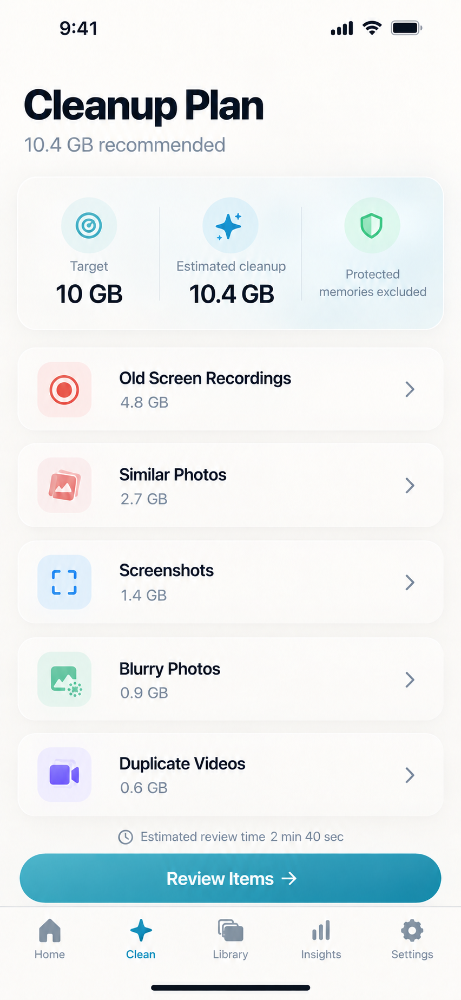

**Purpose**  
Show how the target will be achieved while preserving trust.

**Key UI elements**
- summary card
- category breakdown rows
- protected memories note
- review CTA

---

## 05 — Similar Photos groups (v1.0)

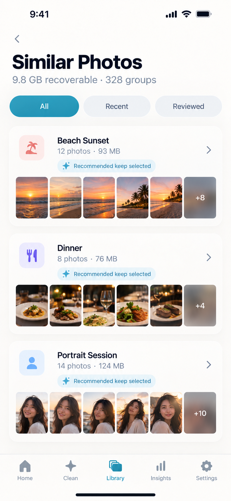

**Purpose**  
Provide grouped photo review in a gallery-like experience.

**Key UI elements**
- group cards
- thumbnail strips
- recommendation badges
- filter chips

---

## 06 — Best Shot review (v1.0)

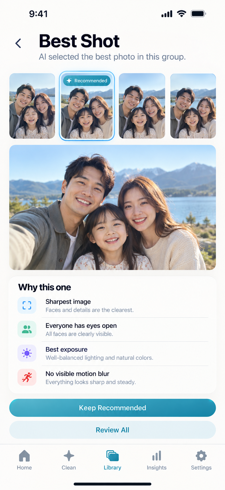

**Purpose**  
Explain the AI recommendation clearly.

**Key UI elements**
- thumbnail strip
- selected hero image
- "Why this one" explanation card
- primary and secondary actions

---

## 07 — Insights / storage forecast (v1.0)

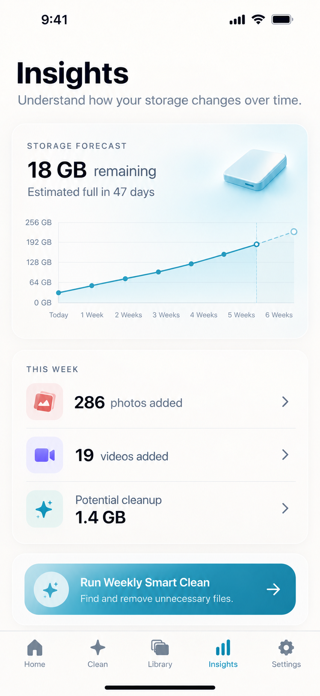

**Purpose**  
Turn the app into a recurring maintenance product.

**Key UI elements**
- storage forecast hero card
- line chart
- weekly summary card
- smart clean CTA

---

## 08 — Videos / compression (v1.0)

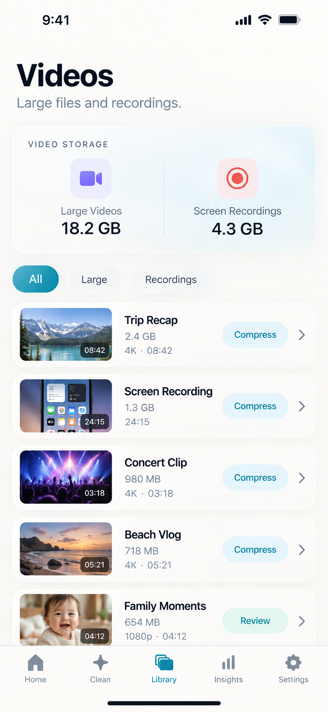

**Purpose**  
Offer large-video management and compression as an alternative to deletion.

**Key UI elements**
- summary card for large videos and screen recordings
- filter chips
- media rows with thumbnails
- compress / review actions

---

## 09 — Settings / privacy (v1.0)

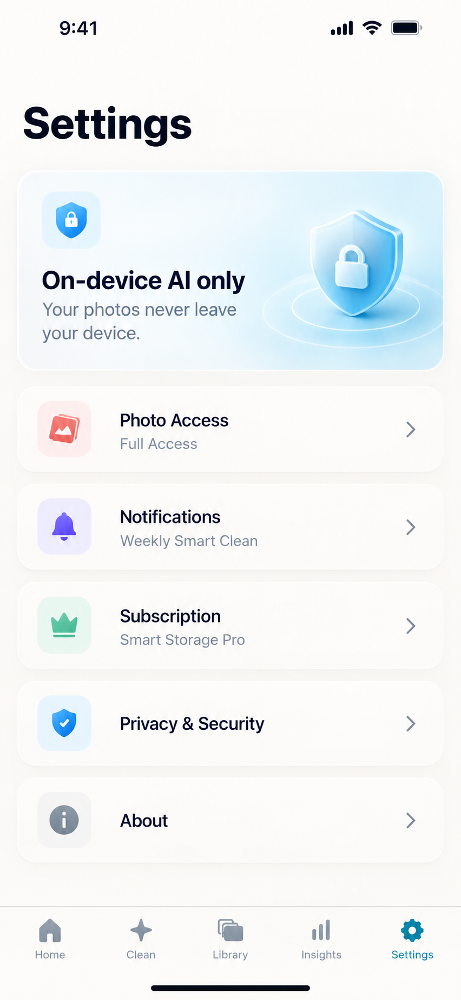

**Purpose**  
Make the privacy stance visible and central.

**Key UI elements**
- On-device AI hero card
- permissions / subscription / privacy rows

---

## 10 — Memories protected (v1.0)

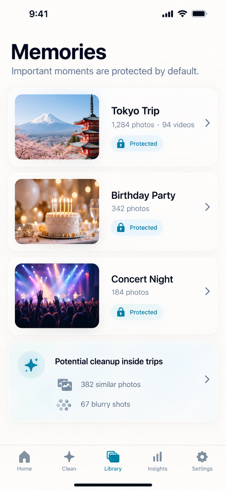

**Purpose**  
Reassure users that important memories are recognized and protected.

**Key UI elements**
- event / trip cards
- protected states and supportive copy

---

## 11 — Screenshots semantic cleanup (v1.0)

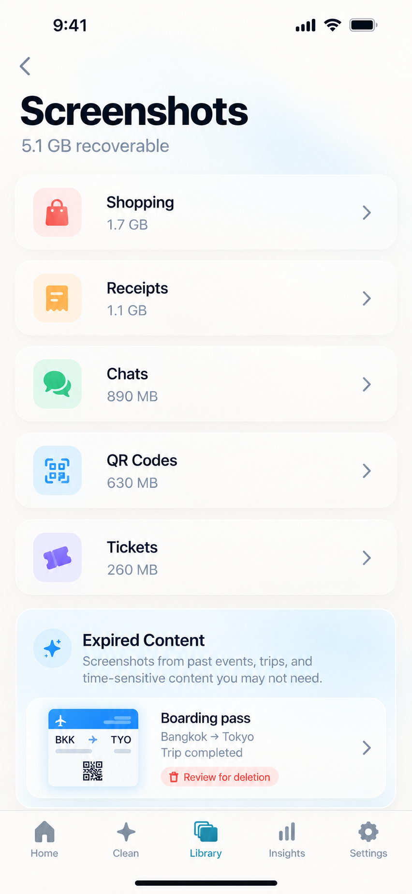

**Purpose**  
Show that screenshots are understood semantically, not just grouped blindly.

**Key UI elements**
- category rows
- recoverable amount
- expired content preview

---

## 12 — Cloud sync overview (v1.1)

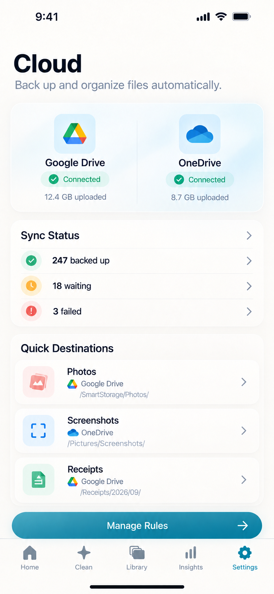

**Purpose**  
Introduce cloud capabilities without breaking the premium feel.

**Key UI elements**
- Google Drive connected card
- OneDrive connected card
- Sync Status rows
- Quick Destinations section
- Manage Rules CTA

**Design notes**
- provider cards must feel neutral and elegant
- connected state should be clearly positive but not loud
- this screen lives naturally under Settings or a Cloud section

---

## 13 — Manual backup / receipts (v1.1)

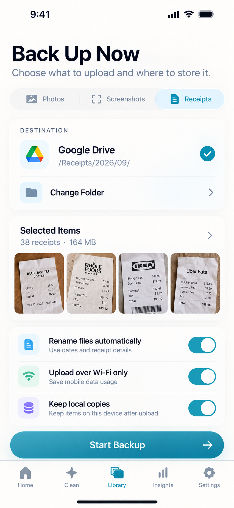

**Purpose**  
Support manual backup with destination choice and upload preferences.

**Key UI elements**
- segmented control: Photos / Screenshots / Receipts
- destination card
- folder row
- selected items preview with thumbnails
- upload preference rows with toggles
- Start Backup CTA

**Design notes**
- keep the form light and approachable
- thumbnails give confidence in what will be uploaded
- destination area must clearly communicate the chosen path

---

## 14 — Storage rules list (v1.2)

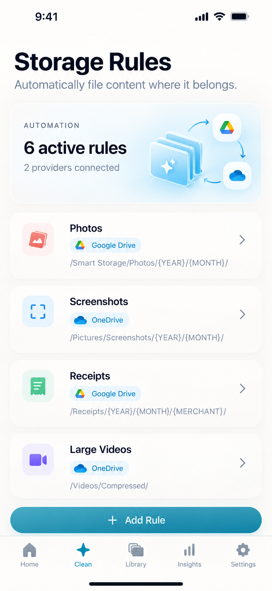

**Purpose**  
Show that automation is a premium organizational feature.

**Key UI elements**
- automation hero summary card
- rules rows with icon, provider badge, folder template
- Add Rule CTA

**Design notes**
- keep rules highly readable
- provider identity should be visible but not brand-heavy
- path templates should wrap gracefully if localized

---

## 15 — New Rule builder (v1.2)

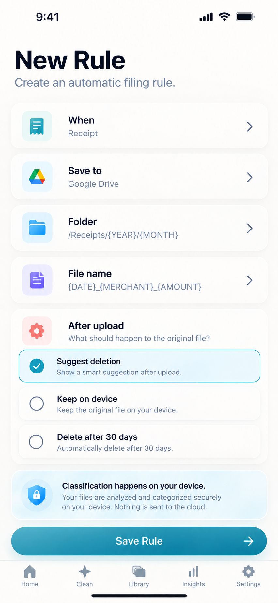

**Purpose**  
Allow users to create automation without exposing technical complexity.

**Key UI elements**
- stacked form cards: When / Save to / Folder / File name
- After upload policy section
- on-device privacy info card
- Save Rule CTA

**Design notes**
- this should feel like a guided setup flow
- the selected policy state must be obvious
- the privacy info card is important to reduce cloud anxiety

---

## 16 — Receipt Filing (v1.3)

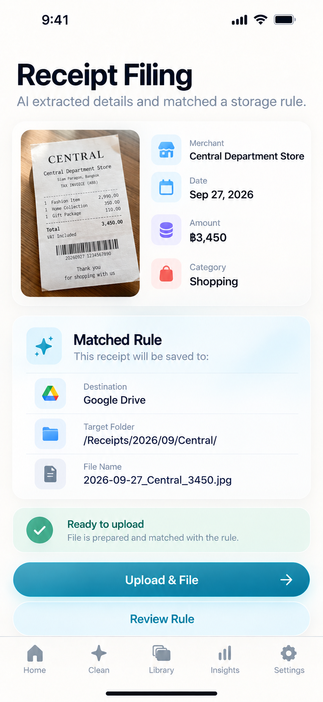

**Purpose**  
Demonstrate semantic understanding and rule matching.

**Key UI elements**
- receipt preview
- extracted fields: merchant, date, amount, category
- matched rule card
- destination path and generated file name
- ready-to-upload state
- Upload & File CTA

**Design notes**
- this is a hero intelligence screen
- extraction should feel trustworthy and structured
- success states should be calm and premium

---

## 17 — Backup verification & safe delete (v1.3)

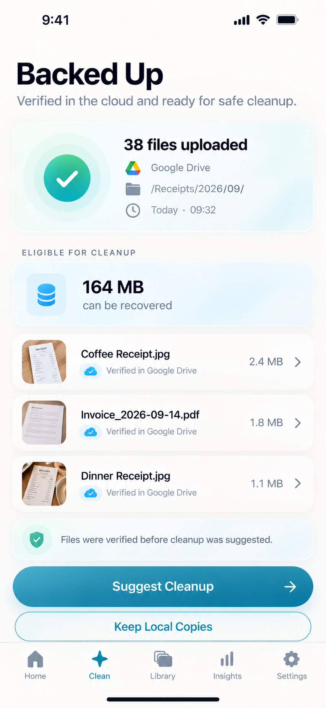

**Purpose**  
Close the loop between backup and cleanup in a trustworthy way.

**Key UI elements**
- uploaded files hero success card
- recoverable storage card
- verified file rows
- note explaining verification happened before cleanup suggestion
- Suggest Cleanup / Keep Local Copies actions

**Design notes**
- never look aggressive about deletion
- verification must be emotionally reassuring
- success and cleanup need to be visually balanced

---

# 6. Motion and interaction guidance

## 6.1 Motion

Use only soft motion:
- fade in
- slight lift on tap
- subtle chart animation
- light spring for selected states
- crossfade between recommendation previews

Avoid:
- noisy transitions
- exaggerated bounces
- flashy neon highlights

## 6.2 Haptics

Recommended for:
- save rule
- backup started
- backup completed
- cleanup plan created
- cleanup completed

---

# 7. Developer implementation guidance

## 7.1 Suggested implementation order

### Shared foundation
1. design tokens
2. typography styles
3. shared cards
4. buttons
5. badges
6. segmented controls
7. media row cells
8. provider badges
9. status indicators
10. tab bar shell

### Screen order
1. Onboarding
2. Home
3. Clean target
4. Cleanup plan
5. Similar Photos
6. Best Shot
7. Screenshots
8. Videos
9. Insights
10. Settings
11. Cloud Overview
12. Manual Backup
13. Storage Rules
14. New Rule
15. Receipt Filing
16. Backup Verification
17. Memories

## 7.2 Data-driven design notes

- all file sizes are dynamic
- all counts are dynamic
- folder paths can be long
- extracted values can vary in length
- filenames can wrap if necessary
- provider state may include connected / disconnected / error

## 7.3 Platform notes

- maintain iOS-first polish
- keep layouts adaptable to Android while respecting native conventions
- preserve rounded-card structure and calm spacing across platforms

---

# 8. Final design summary

From v1.0 to v1.3, the product evolves visually from:

- cleanup and protection

to:

- cleanup + backup + organization + automation + verification

The most important design goal throughout all versions is consistency:

- same app shell
- same visual language
- same trust-oriented behavior
- same premium, built-in-app character
